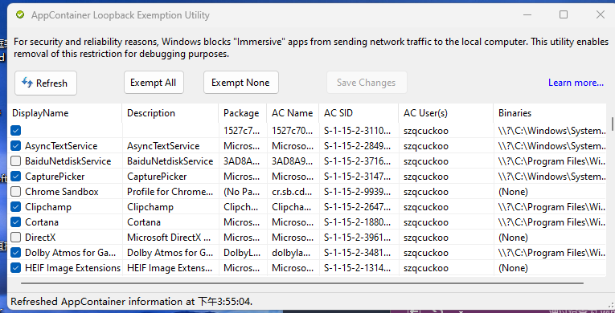

> 原因：微软在win10中引入UWP的新概念，为了安全性以及纯净性，所有的UWP应用均运行在一个叫做App Container的虚拟沙箱中，但是也因此阻止了网络流量发送到本机，使得大部分网络抓包工具无法对UWP应用进行流量分析，同样的该机制也组织了UWP应用访问localhost，因此开始网络代理以后也无法令UWP应用访问本地代理服务器。

## 有如下几种解决方案：

### 1. 使用一款名为 CheckNetlsolation.exe 的命令行工具，可以将UWP应用添加到排除列表。

首先通过 Win + R 快捷键打开「运行」窗口，输入「Regedit」打开注册表编辑器，然后定位到 HKEY\_CURRENT\_USER\\Software\\Classes\\Local Settings\\Software\\Microsoft\\Windows\\CurrentVersion\\AppContainer\\Mappings ，接着在左边的注册表项中找到你想解除网络隔离的应用，右边的 DisplayName 就是应用名称，而左边那一大串字符就是应用的 SID 值了。

在终端中输入 ==CheckNetIsolation.exe loopbackexempt -a -p=SID==，出现「完成」后就大功告成了。

### 2. 一个是 Windows Loopback Exemption Manager

[Windows Loopback Exemption Manager](https://github.com/tiagonmas/Windows-Loopback-Exemption-Manager)

选中前面的方块点击 Save Changes即可

